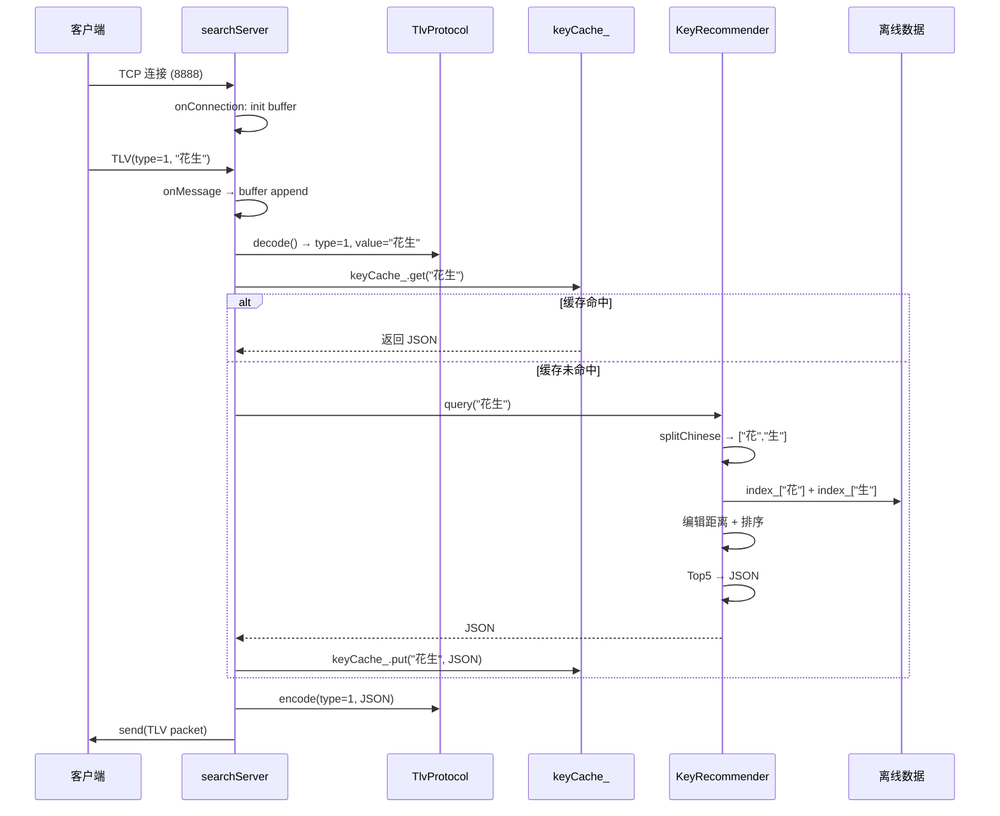
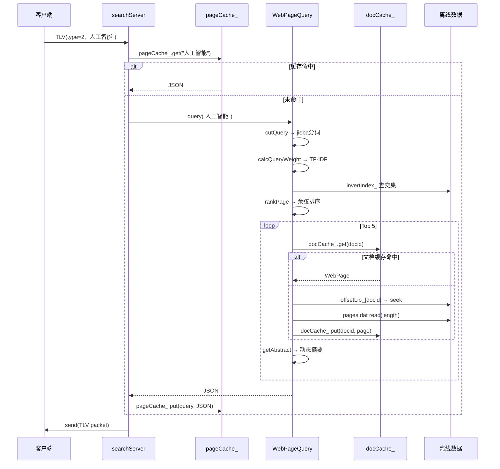

# NutShell 搜索引擎 — 项目完整流程

## 目录

1. [项目架构总览](#1-项目架构总览)
2. [程序入口](#2-程序入口)
3. [第一期：离线建库](#3-第一期离线建库)
4. [第二期：在线服务](#4-第二期在线服务)
5. [第三期：缓存优化](#5-第三期缓存优化)
6. [通信协议：TLV](#6-通信协议tlv)
7. [公共模块：TextUtils](#7-公共模块textutils)
8. [完整调用链路](#8-完整调用链路)
9. [数据文件依赖全图](#9-数据文件依赖全图)

---

## 1. 项目架构总览

```
                            NutShell Search
                                 │
          ┌──────────────────────┼──────────────────────┐
          │                      │                      │
    第一期：离线建库         第二期：在线服务         第三期：缓存优化
    (offline_search)      (online_search)         (LRU + 分片缓存)
          │                      │                      │
    处理原始语料             muduo TCP 服务器        加速热点查询
    生成 7 个数据文件         TLV 协议通信            减少磁盘 IO
          │                 JSON 序列化返回           降低锁竞争
          │                      │
          └──────────┬───────────┘
                     │
              离线数据文件
        cn_dict.dat / cn_index.dat
        en_dict.dat / en_index.dat
        pages.dat / offsets.dat
        index.dat (倒排索引)
```

**三期关系**：
- 第一期是"生产者"，生成离线数据
- 第二期是"消费者"，加载离线数据提供在线查询
- 第三期是"加速器"，给第二期加缓存提升性能

---

## 2. 程序入口

项目有两个独立的可执行文件，各自有入口。

### 2.1 离线入口：`offline_main.cpp`

```cpp
#include "../../include/offline/KeywordProcessor.h"
#include "../../include/offline/PageProcessor.h"
#include <iostream>

using namespace std;

int main()
{
    // 关键字推荐离线建库
    KeyWordProcessor kw;
    kw.process("data/corpus/CN", "data/corpus/EN");
    // 生成: cn_dict.dat, cn_index.dat, en_dict.dat, en_index.dat

    // 网页搜索离线建库
    PageProcessor ps;
    ps.process("data/corpus/webpages");
    // 生成: pages.dat, offsets.dat, index.dat

    return 0;
}
```

### 2.2 在线入口：`online_main.cc`

```cpp
#include <muduo/net/InetAddress.h>
#include <muduo/net/EventLoop.h>
#include "../../include/online/searchServer.h"

using namespace std;
using namespace muduo;
using namespace muduo::net;

int main()
{
    // ① 创建 Reactor 事件循环（muduo 核心驱动引擎）
    EventLoop loop;

    // ② 指定监听端口
    InetAddress listenAddr(8888);

    // ③ 创建搜索服务器（构造时加载所有离线数据到内存）
    searchServer server(&loop, listenAddr);

    // ④ 启动 TCP 监听
    server.start();

    // ⑤ 进入事件循环（阻塞，直到 Ctrl+C）
    loop.loop();

    return 0;
}
```

---

## 3. 第一期：离线建库

### 3.1 关键字推荐离线流程

```
corpus/EN/* 文本文件
    │
    ├── DirectoryScanner::scan("corpus/EN")
    │     返回所有 .txt 文件的绝对路径
    │
    ├── create_en_dict()
    │     ├── loadStopWords("en_stopwords.txt")  → enStopWords_ (unordered_set)
    │     ├── 逐文件 → 逐行读取
    │     ├── 数据清洗: 非字母→空格, tolower
    │     ├── 按空白分词
    │     ├── 过滤停用词
    │     ├── 统计词频 → wordFreq (unordered_map<string,int>)
    │     └── 输出 dict_en.dat: "word frequency\n"
    │
    └── build_en_index()
          ├── 读取 dict_en.dat → vector<pair<string,int>>
          ├── 遍历每个单词的每个字符
          │      index[char].insert(行号)
          └── 输出 index_en.dat: "char id1 id2 ...\n"
```

```
corpus/CN/* 文本文件
    │
    ├── create_cn_dict()
    │     ├── jieba.Cut(content, words)  // Mix 模式
    │     ├── 过滤: 空串/停用词/非中文(isChineseWord)
    │     ├── 统计词频
    │     └── 输出 dict_cn.dat
    │
    └── build_cn_index()
          ├── 读取 dict_cn.dat
          ├── 遍历每个词的每个汉字(utf8::next 拆分)
          │      index[汉字].insert(行号)
          └── 输出 index_cn.dat
```

### 3.2 网页搜索离线流程

```
corpus/webpages/*.xml
    │
    ├── extract_documents(dir)
    │     ├── DirectoryScanner::scan(dir)
    │     ├── tinyxml2::XMLDocument::LoadFile
    │     ├── rss → channel → item 遍历
    │     ├── 提取 title/link/content(或description)
    │     ├── clean_html(): 去 <tag> 和 &nbsp;
    │     └── 存入 documents_ (vector<Document>)
    │
    ├── deduplicate_documents()
    │     ├── 对每篇文档: simhash::Simhasher::make(content, topN, hash)
    │     ├── 计算 topN = max(5, min(200, content.size()/120))
    │     ├── 新 hash 与已有指纹逐一比较
    │     │      simhash::Simhasher::isEqual(hash, oldHash)
    │     └── 不重复 → 存入 uniqueDocuments_
    │
    ├── build_pages_and_offsets()
    │     ├── 序列化: <doc><id/><title/><link/><content/></doc>
    │     ├── pageFile.tellp() 记录偏移 → offsets.dat
    │     └── 写入 pages.dat
    │
    └── build_inverted_index()
          ├── 对每篇文档 jieba 分词
          ├── 计算 TF = count / totalWords
          ├── 计算 DF = 包含该词的文档数
          ├── 计算 IDF = log(N / (DF+1))
          ├── weight = TF × IDF
          ├── 归一化: weight /= sqrt(Σ weight²)
          ├── 构建倒排: invertIndex_[word].push_back({docid, weight})
          ├── 按权重降序排列
          └── 输出 index.dat: "word docid weight docid weight ...\n"
```

### 3.3 关键函数：SimHash 去重

```cpp
// 简要流程（详见 PageProcessor.cpp）
void PageProcessor::deduplicate_documents()
{
    vector<uint64_t> fingerPrint;   // 已保存的指纹库

    for (auto& doc : documents_)
    {
        uint64_t hash;
        // topN: 取多少个关键词参与哈希计算
        // 太短的文章用较少的关键词
        int topN = max(5, min(200, (int)doc.content.size() / 120));

        // SimHash 计算指纹
        hasher_.make(doc.content, topN, hash);

        // 与已有指纹逐一比较汉明距离
        bool duplicate = false;
        for (auto oldHash : fingerPrint)
        {
            if (simhash::Simhasher::isEqual(hash, oldHash))
            {
                duplicate = true;
                break;
            }
        }

        // 不重复 → 加入去重结果
        if (!duplicate)
        {
            fingerPrint.push_back(hash);
            uniqueDocuments_.push_back(doc);
        }
    }
}
```

### 3.4 关键函数：TF-IDF 与归一化

```cpp
// 简化示意（详见 PageProcessor.cpp build_inverted_index）

// ① 计算 TF
for (const auto& doc : uniqueDocuments_)
{
    vector<string> words;
    tokenizer_.Cut(doc.content, words);  // jieba 分词
    // 过滤停用词、非中文...

    unordered_map<string, int> countMap;
    for (auto& word : validWords) ++countMap[word];

    for (const auto& [word, count] : countMap)
    {
        tf[word] = (double)count / totalWords;  // TF = 词频/总词数
    }
}

// ② 计算 DF
for (const auto& [id, tfMap] : tfMap_)
    for (const auto& [word, _] : tfMap)
        ++dfMap_[word];  // 每篇文档出现一次，DF+1

// ③ 计算 IDF = log(N / (DF+1))
for (const auto& [word, df] : dfMap_)
    idfMap_[word] = log((double)N / (df + 1));

// ④ TF-IDF = TF × IDF
for (const auto& [id, tfMap] : tfMap_)
    for (const auto& [word, tfValue] : tfMap)
        weights[word] = tfValue * idfMap_[word];

// ⑤ 归一化: weight /= sqrt(Σ weight²)
double norm = sqrt(Σ weight²);
for (auto& [_, weight] : weights)
    weight /= norm;
```

---

## 4. 第二期：在线服务

### 4.1 服务器启动流程

```
online_main.cc
  │
  ├── EventLoop loop;                      // 创建 Reactor 事件循环
  ├── InetAddress listenAddr(8888);        // 监听 8888 端口
  ├── searchServer server(&loop, ...);     // 构造函数
  │     ├── 创建 TcpServer, 注册回调
  │     ├── new KeyRecommender()           // 加载 cn_dict.dat + cn_index.dat
  │     │     ├── loadDict()  → dict_ (1.7万条)
  │     │     └── loadIndex() → index_ (3千个索引键)
  │     └── new WebPageQuery()             // 加载 pages/offsets/index
  │           ├── loadStopWords()
  │           ├── loadOffsetLib()  → offsetLib_ (3.7k条)
  │           └── loadInvertIndex() → invertIndex_ (9.3万条)
  ├── server.start();                      // 开始监听
  └── loop.loop();                         // 事件循环（阻塞）
```

### 4.2 请求处理流程

```
客户端 → TCP → TLV 数据包 → searchServer::onMessage()
                                   │
                                   ├── 追加到 connectionBuffer_[conn]
                                   ├── 循环 TlvProtocol::decode() 拆包
                                   │
                                   ├── type = 1 → handleKeyRecommend()
                                   │     ├── 查 keyCache_（LRU 分片缓存）
                                   │     ├── 命中 → 直接返回
                                   │     └── 未命中 → KeyRecommender::query()
                                   │           └── 结果写入缓存 → 返回 JSON
                                   │
                                   ├── type = 2 → handleWebPageSearch()
                                   │     ├── 查 pageCache_
                                   │     ├── 命中 → 直接返回
                                   │     └── 未命中 → WebPageQuery::query()
                                   │           └── 结果写入缓存 → 返回 JSON
                                   │
                                   └── TlvProtocol::encode(type, json)
                                       → conn->send(packet)
```

### 4.3 关键字推荐：KeyRecommender

```
query("花生")
  │
  ├── ① splitChinese("花生") → ["花", "生"]
  │
  ├── ② 查索引取并集
  │     index_["花"] → {12, 45, 201, 512, ...}
  │     index_["生"] → {45, 89, 512, 730, ...}
  │     candidateIds = {12, 45, 89, 201, 512, 730, ...}
  │
  ├── ③ 计算编辑距离（每个候选词 vs 输入词）
  │     dp[i][j] = 将 word1[0..i) 变成 word2[0..j) 的最少操作数
  │     插入/删除/替换 各算 1 次
  │
  ├── ④ 优先级队列排序（先比编辑距离→词频→字典序）
  │
  └── ⑤ 取 Top 5 → 构建 JSON 返回
```

**编辑距离算法核心**：

```cpp
int KeyRecommender::editDistance(const string& lhs, const string& rhs)
{
    auto left  = splitChinese(lhs);   // 拆成汉字数组
    auto right = splitChinese(rhs);

    size_t m = left.size(), n = right.size();
    vector<vector<int>> dp(m + 1, vector<int>(n + 1));

    // 初始化：空串到 i 个字符 = i 次操作
    for (size_t i = 0; i <= m; ++i) dp[i][0] = i;
    for (size_t j = 0; j <= n; ++j) dp[0][j] = j;

    // 状态转移
    for (size_t i = 1; i <= m; ++i)
        for (size_t j = 1; j <= n; ++j)
            if (left[i-1] == right[j-1])
                dp[i][j] = dp[i-1][j-1];                     // 字符相同
            else
                dp[i][j] = min({dp[i-1][j]+1,                // 删除
                                dp[i][j-1]+1,                // 插入
                                dp[i-1][j-1]+1});            // 替换
    return dp[m][n];
}
```

### 4.4 网页搜索：WebPageQuery

```
query("人工智能发展前沿")
  │
  ├── ① 分词: cutQuery("人工智能发展前沿")
  │     jieba.Cut → ["人工智能", "发展", "前沿"]
  │     过滤: 空串/空格/换行/停用词
  │
  ├── ② 查询向量权重: calcQueryWeight(keywords)
  │     TF = 词出现次数 / 查询总词数
  │     IDF = log(N / (DF+1))       ← 从倒排索引获取 DF
  │     weight = TF × IDF
  │     归一化: weight /= sqrt(Σ weight²)
  │
  ├── ③ 候选 docid 交集: getCandidateDocIds(keywords)
  │     invertIndex_["人工智能"] ∩ invertIndex_["发展"] ∩ invertIndex_["前沿"]
  │     用 set_intersection 逐个求交
  │     找不到交集 → 返回错误
  │
  ├── ④ 余弦相似度排序: rankPage(candidateIds, queryWeight)
  │     由于双方已归一化，cos(θ) = Σ(qweight × docWeight)
  │     按相似度降序排列
  │
  └── ⑤ 取 Top 5 → 逐篇:
        ├── getDocById(docid)
        │     ├── 查 docCache_ → 命中跳过磁盘 IO
        │     ├── offsetLib_[docid] → {offset, length}
        │     ├── pages.dat seekg(offset) read(length)
        │     └── 解析 <title>/<link>/<content>
        │
        ├── getAbstract(content, keywords)
        │     ├── splitChinese(content) → chars[]
        │     ├── 找第一个关键词的字符位置
        │     └── 取前后各 40 字 ± 省略号
        │
        └── 构建 JSON: {rank, docid, score, title, link, abstract}
```

**余弦相似度核心**：

```cpp
// 查询向量和文档向量都已归一化（模长=1）
// 所以余弦相似度 = 点积 = Σ(docWeight[word] × queryWeight[word])
vector<QueryResult> WebPageQuery::rankPage(
    const vector<int>& docids,
    const unordered_map<string, double>& queryWeight)
{
    vector<QueryResult> results;
    for (int docid : docids)
    {
        double similarity = 0.0;
        for (const auto& [word, qweight] : queryWeight)
        {
            auto it = invertIndex_.find(word);
            if (it == invertIndex_.end()) continue;

            // 遍历倒排列表找当前 docid 的权重
            for (const auto& [id, docWeight] : it->second)
                if (id == docid)
                {
                    similarity += qweight * docWeight;  // 点积累加
                    break;
                }
        }
        results.push_back({docid, similarity});
    }

    // 降序排列
    sort(results.begin(), results.end(),
         [](auto& a, auto& b) { return a.score > b.score; });
    return results;
}
```

---

## 5. 第三期：缓存优化

### 5.1 缓存架构

```
处理请求
  │
  ├── handleKeyRecommend(keyword)
  │     └── keyCache_.get(keyword)  ← ShardedCache<string,string>
  │           │                         1024条 / 8个分片
  │           ├── hash(keyword) % 8 → 分片索引
  │           └── LRUCache<string,string>::get()
  │                 ├── 加锁 (mutex)
  │                 ├── unordered_map O(1) 查找
  │                 ├── 命中: splice 到链表头部 (LRU 刷新)
  │                 └── 解锁
  │
  ├── handleWebPageSearch(query)
  │     └── pageCache_.get(query)    ← ShardedCache<string,string>
  │           │                         512条 / 8个分片
  │           └── (同上)
  │
  └── WebPageQuery::getDocById(docid)
        └── docCache_.get(docid)     ← LRUCache<int, WebPage>
              │                         1024条
              ├── 命中 → 跳过磁盘 IO, 直接返回
              └── 未命中 → seekg + read + parse + 写入缓存
```

### 5.2 LRUCache 实现原理

```
std::list<Key> accessList_  维护访问顺序：
  head ⇄ 最新 ⇄ 较新 ⇄ ... ⇄ 最旧 ⇄ tail

std::unordered_map<Key, pair<Value, list::iterator>> map_  O(1)查找：
  key → (value, 链表中的位置)
```

**put 流程**：
```
① key 存在? → 更新 value, splice 到链表头部
② key 不存在 + 未满 → push_front, map_[key] = {value, iterator}
③ key 不存在 + 已满 → pop_back(最旧), 再 push_front
```

**get 流程**：
```
① map_.find(key) → 未找到: return false
② 找到: splice 到链表头部 (LRU 刷新), return value
```

### 5.3 ShardedCache 分片原理

```
总容量 1024, 分片数 8 → 每个分片容量 128

key="人工智能" → hash("人工智能") = 1234567890
              → 1234567890 % 8 = 2
              → 进入 caches_[2]

key="机器学习" → hash("机器学习") = 9876543210
              → 9876543210 % 8 = 6
              → 进入 caches_[6]

不同 key 大概率落在不同分片 → 不同线程大概率无锁竞争
```

---

## 6. 通信协议：TLV

### 6.1 协议定义

```
┌────────┬────────────────┬─────────────────────┐
│  type  │    length       │       value         │
│ 1 byte │    4 bytes      │    length bytes     │
│ uint8  │ uint32 (大端)    │   UTF-8 字符串      │
└────────┴────────────────┴─────────────────────┘

type = 1: 关键字推荐    type = 2: 网页搜索
```

### 6.2 编码

```cpp
inline std::string encode(uint8_t type, const std::string& value)
{
    uint32_t len    = static_cast<uint32_t>(value.size());
    uint32_t netLen = htonl(len);                    // 主机序 → 网络序(大端)

    std::string packet;
    packet.reserve(1 + 4 + len);
    packet.push_back(static_cast<char>(type));        // type
    packet.append(reinterpret_cast<const char*>(&netLen), 4); // length
    packet.append(value);                             // value
    return packet;
}
```

### 6.3 解码（含恶意包防护）

```cpp
inline bool decode(std::string& buffer, uint8_t& type,
                   std::string& value, bool* error = nullptr)
{
    if (error) *error = false;
    if (buffer.size() < 5) return false;       // 头部不全，等更多数据

    type = static_cast<uint8_t>(buffer[0]);

    uint32_t netLen;
    memcpy(&netLen, buffer.data() + 1, 4);
    uint32_t len = ntohl(netLen);              // 网络序 → 主机序

    if (len > MAX_PACKAGE_SIZE)                // 防止内存耗尽攻击
    {
        if (error) *error = true;
        return false;                          // 调用方应 forceClose
    }

    if (buffer.size() < 5 + len) return false; // 包体不全，等更多数据

    value.assign(buffer.data() + 5, len);
    buffer.erase(0, 5 + len);                  // 从缓冲区消费已处理字节
    return true;
}
```

### 6.4 连接级缓冲区（解决粘包）

```
每个 TCP 连接维护一个独立的 std::string connectionBuffer_

收到数据 → append 到 connectionBuffer_
              │
              ↓
    while (TlvProtocol::decode(buffer, ...))
       ├── true  → 处理这个包, 继续循环（可能一帧多包）
       └── false → 退出循环, 等下次 onMessage 追加数据
```

---

## 7. 公共模块：TextUtils

### 7.1 splitChinese — UTF-8 汉字拆分

```cpp
// UTF-8 是变长编码: 汉字占 3 字节, 英文占 1 字节
// utf8::next 自动识别并跳过正确的字节数

vector<string> splitChinese(const string& text)
{
    vector<string> result;
    const char* curr = text.c_str();
    const char* end  = curr + text.size();

    while (curr != end)
    {
        auto start = curr;              // 当前字符起点
        utf8::next(curr, end);          // 前进到下一个字符起点
        result.emplace_back(start, curr); // [start, curr) 即一个完整字符
    }
    return result;
}
// "你好" → ["你", "好"]
// "hello" → ["h", "e", "l", "l", "o"]
```

### 7.2 loadStopWords — 加载停用词

```cpp
unordered_set<string> loadStopWords(const string& path)
{
    unordered_set<string> stopWords;
    ifstream ifs{path};
    string word;
    while (ifs >> word)
        stopWords.insert(word);
    return stopWords;
}
```

### 7.3 isChineseWord — 判断是否纯中文

```cpp
bool isChineseWord(const string& word)
{
    const char* curr = word.c_str();
    const char* end  = curr + word.size();
    while (curr < end)
    {
        uint32_t codepoint = utf8::next(curr, end);
        if (codepoint < 0x4E00 || codepoint > 0x9FFF)  // 不在统一汉字区
            return false;
    }
    return true;
}
```

---

## 8. 完整调用链路

### 8.1 关键字推荐请求



### 8.2 网页搜索请求



---

## 9. 数据文件依赖全图

```
                    ┌─────────────────┐
                    │  原始语料 corpus  │
                    │  CN/ EN/ webpages│
                    └────────┬────────┘
                             │
                    ┌────────▼────────┐
                    │  offline_search │ (第一期)
                    └────────┬────────┘
                             │
        ┌────────────────────┼────────────────────┐
        │                    │                    │
   ┌────▼────┐         ┌────▼────┐         ┌─────▼──────┐
   │dict_cn  │         │pages.dat│         │index.dat   │
   │dict_en  │         │offsets  │         │(倒排索引)   │
   │index_cn │         │   .dat  │         │            │
   │index_en │         └────┬────┘         └─────┬──────┘
   └────┬────┘              │                    │
        │                   │                    │
   ┌────▼────┐         ┌────▼────────────────────▼──┐
   │KeyRecomm│         │       WebPageQuery          │
   │  ender  │         │  offsetLib_ + invertIndex_  │
   └────┬────┘         │  + docCache_                │
        │              └────────────┬────────────────┘
        │                           │
   ┌────▼───────────────────────────▼──┐
   │          searchServer             │
   │  + keyCache_  + pageCache_       │
   └────────────────┬──────────────────┘
                    │
            ┌───────▼───────┐
            │  online_search │ (第二期+第三期)
            │  (muduo:8888)  │
            └───────┬───────┘
                    │ TLV 协议
            ┌───────▼───────┐
            │   客户端/前端   │
            │  (app.py:8080) │
            └───────────────┘
```

---

> 文档版本: 2026-06  |  作者: NutShell Search Team
