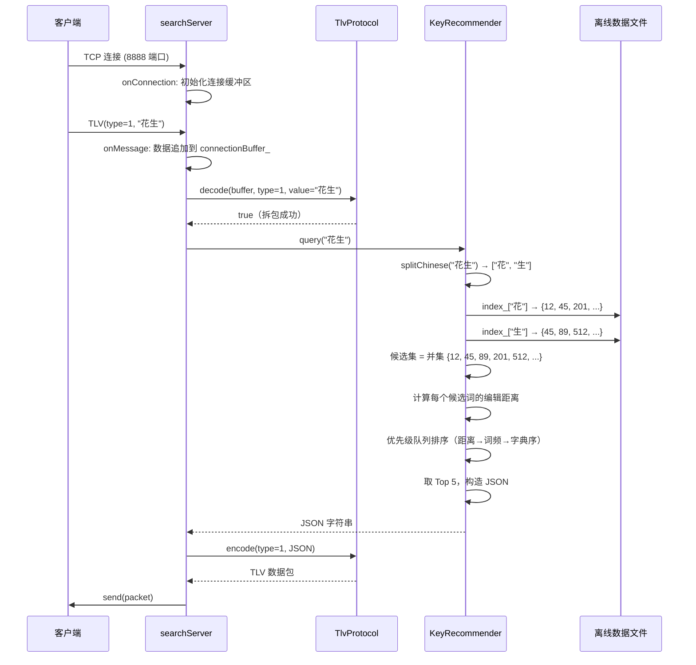
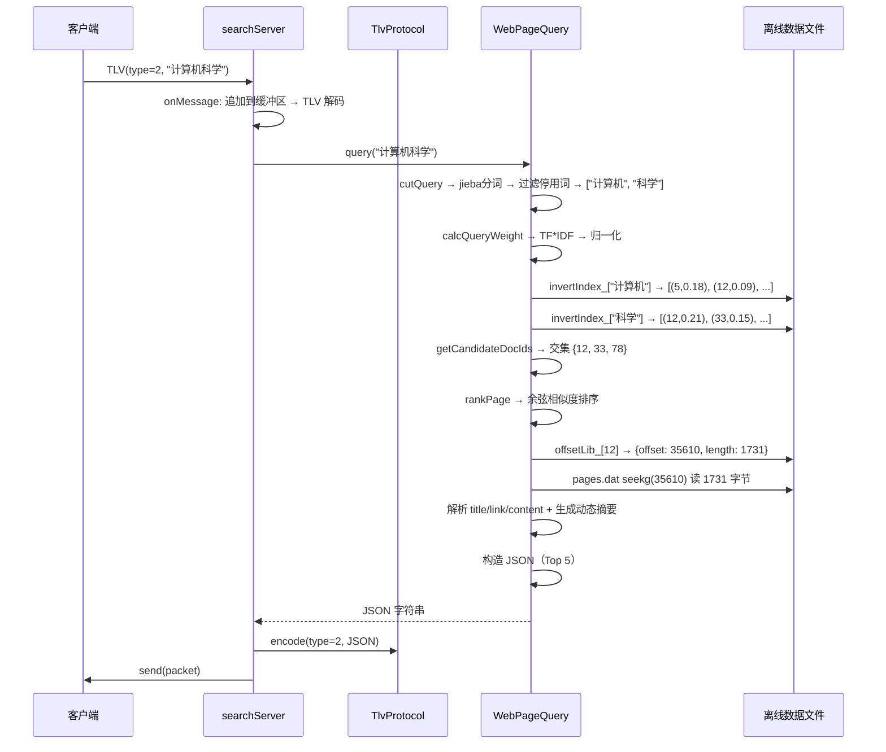

# 搜索引擎项目 · 第二期在线服务流程文档

## 目录

1. [总体架构](#1-总体架构)
2. [程序入口：online_main.cc](#2-程序入口onlinemaincc)
3. [网络协议层：TlvProtocol](#3-网络协议层tlvprotocol)
4. [服务器核心：searchServer](#4-服务器核心searchserver)
5. [关键字推荐：KeyRecommender](#5-关键字推荐keyrecommender)
6. [网页搜索：WebPageQuery](#6-网页搜索webpagequery)
7. [公共工具：TextUtils](#7-公共工具textutils)
8. [完整调用链路图](#8-完整调用链路图)
9. [数据文件依赖关系](#9-数据文件依赖关系)

---

## 1. 总体架构

第二期的目标是：基于第一期生成的离线数据文件，搭建一个 **muduo TCP 服务器**，对外提供两个查询服务。

```
┌──────────┐    TCP(TLV)    ┌─────────────────────────────────┐
│  客户端   │ ─────────────→ │          online_search          │
│ (Python)  │ ←───────────── │                                  │
└──────────┘    TCP(TLV)    │  ┌───────────────────────────┐  │
                            │  │       searchServer         │  │
                            │  │  onMessage() → TLV 解码    │  │
                            │  │    ├─ type=1 → KeyRecommender│  │
                            │  │    └─ type=2 → WebPageQuery │  │
                            │  └───────────────────────────┘  │
                            │               │                  │
                            │    加载离线数据文件               │
                            │  cn_dict.dat / cn_index.dat      │
                            │  pages.dat / offsets.dat         │
                            │  index.dat / en_stopwords.txt    │
                            └─────────────────────────────────┘
```

**核心依赖**：

| 库 | 用途 |
|----|------|
| muduo | Reactor 模式的 TCP 网络框架 |
| nlohmann/json | JSON 序列化，将查询结果编码返回客户端 |
| cppjieba | 中文分词（WebPageQuery 中切词用） |
| utfcpp | UTF-8 字符拆分（编辑距离、动态摘要用） |

---

## 2. 程序入口：online_main.cc

整个服务器的启动点，极其简洁——创建事件循环、创建服务器、进入循环。

```cpp
#include <iostream>
#include <muduo/net/InetAddress.h>
#include <muduo/net/TcpConnection.h>
#include <muduo/net/EventLoop.h>
#include "../../include/online/KeyRecommender.h"
#include "../../include/online/WebPageQuery.h"
#include "../../include/online/searchServer.h"

using namespace std;
using namespace muduo;
using namespace muduo::net;

int main()
{
    // ============================================================
    // 第 1 步：创建 Reactor 事件循环
    // EventLoop 是整个 muduo 的核心驱动引擎，一个线程一个 loop
    // 它循环等待 IO 事件（新连接、数据到达等），触发对应回调
    // ============================================================
    EventLoop loop;

    // ============================================================
    // 第 2 步：指定监听地址和端口
    // InetAddress(8888) → 监听本机所有网卡的 8888 端口
    // ============================================================
    InetAddress listenAddr(8888);

    // ============================================================
    // 第 3 步：创建搜索服务器
    // 构造函数内部会：
    //   - 创建 TcpServer 对象（绑定端口、设置回调）
    //   - 实例化 KeyRecommender（加载 cn_dict.dat / cn_index.dat）
    //   - 实例化 WebPageQuery（加载 pages.dat / offsets.dat / index.dat）
    // ============================================================
    searchServer server(&loop, listenAddr);

    // ============================================================
    // 第 4 步：启动监听
    // ============================================================
    server.start();

    // ============================================================
    // 第 5 步：进入事件循环（阻塞）
    // 此后 main 线程停在 loop.loop() 中，不断处理 IO 事件
    // 直到收到 SIGINT（Ctrl+C）或被 kill
    // ============================================================
    loop.loop();

    return 0;
}
```

**启动日志示例**：

```
dict size = 17040
index size = 3086
loading KeyRecommender data...
loading WebPageQuery data...
offset size = 3788
invert Index size = 92769
All data loaded
SearchServer started , listening on port 0.0.0.0:8888
```

---

## 3. 网络协议层：TlvProtocol

### 3.1 为什么需要 TLV

TCP 是**流式协议**，没有消息边界。一条 `send("hello")` 和另一条 `send("world")` 可能被对方一次 `read` 全收到（`"helloworld"`），这叫**粘包**。

TLV（Type-Length-Value）是解决粘包的经典方案：每条消息前加上固定长度的头部，告诉接收方"后面还有多少字节"。

### 3.2 协议格式

```
┌────────┬────────────────┬─────────────────────┐
│  type  │    length       │       value          │
│ 1 byte │    4 bytes      │    length bytes      │
│ uint8  │ uint32 (大端)    │    UTF-8 字符串      │
└────────┴────────────────┴─────────────────────┘
```

- **type = 1**：关键字推荐请求/响应
- **type = 2**：网页搜索请求/响应
- **length**：网络字节序（大端），用 `htonl`/`ntohl` 转换
- **value**：请求时是查询字符串，响应时是 JSON

### 3.3 完整代码与注释

```cpp
#pragma once
#include <cstring>       // memcpy
#include <arpa/inet.h>   // htonl, ntohl（网络字节序转换）
#include <string>
#include <cstdint>
#include <iostream>

// 消息类型枚举
enum TlvType : uint8_t
{
    TYPE_KEYWORD_RECOMMEND = 1,  // 关键字推荐
    TYPE_WEBPAGE_SEARCH    = 2   // 网页搜索
};

namespace TlvProtocol
{

// ================================================================
// encode：把 type + value 打包成网络字节流（可直接 send 到 socket）
//
// 参数：
//   type  —— 消息类型（1 或 2）
//   value —— 消息体（查询词 或 JSON 结果）
// 返回值：完整的 TLV 数据包（二进制）
// ================================================================
inline std::string encode(uint8_t type, const std::string& value)
{
    // (1) 获取 value 的字节长度
    uint32_t len = static_cast<uint32_t>(value.size());

    // (2) 转成网络字节序（大端）
    // htonl = Host TO Network Long
    // 不同 CPU 字节序不同（x86 是小端），网络传输统一用大端
    uint32_t netLen = htonl(len);

    // (3) 拼接数据包：1字节type + 4字节length + value
    std::string packet;
    packet.reserve(1 + 4 + len);       // 预分配内存，避免多次扩容

    packet.push_back(static_cast<char>(type));              // type
    packet.append(reinterpret_cast<const char*>(&netLen), 4); // length
    packet.append(value);                                     // value

    return packet;
}

// ================================================================
// decode：从字节流缓冲区中尝试提取一个完整的 TLV 包
//
// 参数：
//   buffer —— [in/out] 接收缓冲区。成功提取后，已消费的字节被删除
//   type   —— [out]    解析出的消息类型
//   value  —— [out]    解析出的消息体
//
// 返回值：true  = 成功解析一个包
//         false = 数据不够（等下次收到更多数据再试）
//
// 设计思路：
//   每次收到数据后追加到 buffer，然后循环调 decode。
//   如果 buffer 里有一个半包，decode 先处理完第一个，
//   第二个可能头部不全，返回 false 等待后续数据。
// ================================================================
inline bool decode(std::string& buffer, uint8_t& type, std::string& value)
{
    // (1) 头部 5 字节还没到齐 → 等下次
    if (buffer.size() < 5)
    {
        return false;
    }

    // (2) 解析 type（第 1 字节）
    type = static_cast<uint8_t>(buffer[0]);

    // (3) 解析 length（第 2~5 字节）
    uint32_t netLen;
    memcpy(&netLen, buffer.data() + 1, 4);

    // (4) 网络序 → 主机序
    // ntohl = Network TO Host Long
    uint32_t len = ntohl(netLen);

    // (5) 数据包体还没到齐 → 等下次
    if (buffer.size() < 5 + len)
    {
        return false;
    }

    // (6) 提取 value（从第 6 字节开始，取 len 字节）
    value.assign(buffer.data() + 5, len);

    // (7) 从缓冲区中删除已消费的 5+len 字节
    buffer.erase(0, 5 + len);

    return true;
}

}  // namespace TlvProtocol
```

> **⚠️ 字节序教训**：encode 和 decode 必须使用**同一**字节序。本项目 encode 用 `htonl`（大端），decode 用 `ntohl`（大端），客户端用 `struct.pack('!I', ...)`（`!` = 大端）。早期版本 encode 误用 `htole32`（小端）导致客户端收不到回包。

---

## 4. 服务器核心：searchServer

### 4.1 类设计

```
searchServer
├── 构造时：实例化 KeyRecommender + WebPageQuery（加载离线数据）
├── start()：启动 TCP 监听
├── onConnection()：管理连接级缓冲区
├── onMessage()
│     ├── 追加入缓冲区 → 循环 TlvProtocol::decode 拆包
│     ├── type=1 → handleKeyRecommend() → KeyRecommender::query()
│     └── type=2 → handleWebPageSearch() → WebPageQuery::query()
└── 回包：TlvProtocol::encode(type, json) → conn->send()
```

### 4.2 关键设计：连接级缓冲区

每个 TCP 连接维护一个独立的 `std::string connectionBuffer_`，解决粘包/半包：

```
收到数据 → append 到 connectionBuffer_
               ↓
      TlvProtocol::decode(buffer, ...)
        ├─ true  → 处理这个包，继续循环（可能连收多包）
        └─ false → 退出循环，等下次 onMessage 追加数据
```

### 4.3 完整代码与注释

**头文件 `include/online/searchServer.h`**：

```cpp
#pragma once
#include "TlvProtocol.h"
#include "KeyRecommender.h"
#include "WebPageQuery.h"
#include <memory>
#include <muduo/base/Timestamp.h>
#include <muduo/net/Buffer.h>
#include <muduo/net/Callbacks.h>
#include <muduo/net/TcpServer.h>
#include <muduo/base/Logging.h>
#include <string>
#include <unordered_map>

class searchServer
{
public:
    // 构造函数：传入事件循环和监听地址
    searchServer(muduo::net::EventLoop* loop,
                 const muduo::net::InetAddress& listenAddr);

    // 启动监听
    void start();

private:
    // ---- muduo 回调（由事件循环驱动） ----

    // 连接建立 / 断开
    void onConnection(const muduo::net::TcpConnectionPtr& conn);

    // 收到数据（核心入口）
    void onMessage(const muduo::net::TcpConnectionPtr& conn,
                   muduo::net::Buffer* buf,
                   muduo::Timestamp receiveTime);

    // ---- 业务处理 ----

    // 处理关键字推荐请求，返回 JSON 字符串
    std::string handleKeyRecommend(const std::string& keyword);

    // 处理网页搜索请求，返回 JSON 字符串
    std::string handleWebPageSearch(const std::string& query);

private:
    // muduo TCP 服务器对象
    muduo::net::TcpServer server_;

    // 每个连接的缓冲区（key = 连接名, value = 未处理完的原始字节）
    // 用 unordered_map 是因为可能同时有多个客户端连接
    std::unordered_map<std::string, std::string> connectionBuffer_;

    // 两个查询处理器（构造时创建，持有离线数据）
    std::unique_ptr<KeyRecommender> keyRecommender_;
    std::unique_ptr<WebPageQuery>  webPageQuery_;
};
```

**实现文件 `src/online/searchServer.cc`**：

```cpp
#include "../../include/online/searchServer.h"
#include <functional>
#include <memory>
#include <muduo/base/Logging.h>

using namespace std;
using namespace placeholders;   // _1, _2, _3 占位符

// ================================================================
// 构造函数
//
// 做三件事：
//   1. 创建 TcpServer，注册回调
//   2. 加载 KeyRecommender（词典 + 索引，约 1.7 万词、3 千个索引键）
//   3. 加载 WebPageQuery（偏移库 + 倒排索引，约 3.7k 文档、9 万倒排项）
//
// muduo 的回调注册用 std::bind 绑定成员函数：
//   _1 → TcpConnectionPtr（连接对象）
//   _2 → Buffer*（接收缓冲区）
//   _3 → Timestamp（收包时间戳）
// ================================================================
searchServer::searchServer(muduo::net::EventLoop* loop,
                           const muduo::net::InetAddress& listenAddr)
    : server_(loop, listenAddr, "SearchServer")
{
    // 注册连接回调：有人连上/断开时调用 onConnection
    server_.setConnectionCallback(
        std::bind(&searchServer::onConnection, this, _1));

    // 注册消息回调：收到数据时调用 onMessage
    server_.setMessageCallback(
        std::bind(&searchServer::onMessage, this, _1, _2, _3));

    // 构造时一次性加载所有离线数据到内存
    LOG_INFO << "loading KeyRecommender data...";
    keyRecommender_ = make_unique<KeyRecommender>();

    LOG_INFO << "loading WebPageQuery data...";
    webPageQuery_ = make_unique<WebPageQuery>();

    LOG_INFO << "All data loaded";
}

// ================================================================
// start()：启动 TCP 监听
// ================================================================
void searchServer::start()
{
    server_.start();
    LOG_INFO << "SearchServer started, listening on port" << server_.ipPort();
}

// ================================================================
// onConnection()：连接状态变化回调
//
// 连接建立时：为该连接初始化一个空的缓冲区
// 连接断开时：清理该连接的缓冲区（防止内存泄漏）
// ================================================================
void searchServer::onConnection(const muduo::net::TcpConnectionPtr& conn)
{
    if (conn->connected())
    {
        LOG_INFO << "New connection from " << conn->peerAddress().toIpPort();
        connectionBuffer_[conn->name()].clear();
    }
    else
    {
        LOG_INFO << "connection closed " << conn->peerAddress().toIpPort();
        connectionBuffer_.erase(conn->name());
    }
}

// ================================================================
// onMessage()：收到数据的核心处理逻辑
//
// 流程：
//   1. 把收到的原始字节追加到该连接的缓冲区
//   2. 循环调用 TlvProtocol::decode 拆包
//      - 缓冲区数据够一个完整包 → 解析 type + value
//      - 数据不够 → 退出循环，等下次收到更多数据
//   3. 根据 type 路由到不同的业务处理器
//   4. 把响应用 TLV 编码后发回客户端
// ================================================================
void searchServer::onMessage(const muduo::net::TcpConnectionPtr& conn,
                              muduo::net::Buffer* buf,
                              muduo::Timestamp /*receiveTime*/)
{
    LOG_INFO << " onMessage start ...";

    // (1) 把 muduo Buffer 里的数据追加到该连接的缓冲区
    string& connBuf = connectionBuffer_[conn->name()];
    connBuf.append(buf->retrieveAllAsString());

    // (2) 循环拆包：可能一次收到多个完整包
    uint8_t type;
    string value;
    while (TlvProtocol::decode(connBuf, type, value))
    {
        // (3) 根据 type 路由
        string response;
        switch (type)
        {
        case TYPE_KEYWORD_RECOMMEND:         // type = 1
            response = handleKeyRecommend(value);
            break;

        case TYPE_WEBPAGE_SEARCH:            // type = 2
            response = handleWebPageSearch(value);
            break;

        default:
            LOG_WARN << "Unknown TLV type : " << static_cast<int>(type);
            response = R"({"error":"unknown type"})";
            break;
        }

        // (4) 回包：把结果用 TLV 编码后发送
        string packet = TlvProtocol::encode(type, response);
        conn->send(packet);
    }
}

// ================================================================
// handleKeyRecommend()：处理关键字推荐
//
// 收到查询词 → 调用 KeyRecommender::query() → 直接返回 JSON
// ================================================================
string searchServer::handleKeyRecommend(const string& keyword)
{
    LOG_INFO << "KeyRecommend query : " << keyword;
    return keyRecommender_->query(keyword);
}

// ================================================================
// handleWebPageSearch()：处理网页搜索
//
// 收到查询词 → 调用 WebPageQuery::query() → 直接返回 JSON
// ================================================================
string searchServer::handleWebPageSearch(const string& query)
{
    LOG_INFO << "WebPage query :" << query;
    return webPageQuery_->query(query);
}
```

---

## 5. 关键字推荐：KeyRecommender

### 5.1 功能概述

用户输入一个**不完整或可能有误**的关键字，系统从词典中找出最相似的 Top 5 候选词。

**示例**：输入"花生" → 返回 "花生"、"花生米"、"花生壳"、"花生油"、"落花生"

### 5.2 核心数据结构

```cpp
// 词典：按行号索引，dict_[i] = {词汇, 词频}
std::vector<std::pair<std::string, int>> dict_;
// 示例：dict_[0] = {"搜索", 88}, dict_[1] = {"引擎", 42}

// 索引：每个汉字 → 包含该字的词典行号集合
std::unordered_map<std::string, std::set<int>> index_;
// 示例：index_["搜"] = {0, 15, 201, ...}
//       index_["索"] = {0, 101, 330, ...}
```

### 5.3 查询流程

```
输入 "花生"
  │
  ├─ 1. splitChinese("花生") → ["花", "生"]
  │
  ├─ 2. 查索引取并集
  │     index_["花"] = {12, 45, 201, 512, ...}
  │     index_["生"] = {45, 89, 512, 730, ...}
  │     candidateIds = {12, 45, 89, 201, 512, 730, ...}
  │
  ├─ 3. 计算每个候选词与 "花生" 的编辑距离
  │     Candidate{word="花生",   freq=50, distance=0}
  │     Candidate{word="花生米", freq=30, distance=1}
  │     Candidate{word="落花生", freq=20, distance=1}
  │     ...
  │
  ├─ 4. 优先级队列排序（先比编辑距离→词频→字典序）
  │
  └─ 5. 取 Top 5，序列化为 JSON 返回
```

### 5.4 编辑距离算法（Levenshtein Distance）

编辑距离 = 将一个词变成另一个词所需的最少操作次数（插入/删除/替换各算 1 次）。

**算法**：动态规划，`dp[i][j]` = `word1[0..i)` 变成 `word2[0..j)` 的最小编辑次数。

```
状态转移：
  if word1[i-1] == word2[j-1]:
      dp[i][j] = dp[i-1][j-1]            # 字符相同，不增加操作
  else:
      dp[i][j] = min(
          dp[i-1][j]   + 1,              # 删除 word1[i-1]
          dp[i][j-1]   + 1,              # 插入 word2[j-1]
          dp[i-1][j-1] + 1               # 替换 word1[i-1] → word2[j-1]
      )
```

> **注意**：中文编辑距离以**汉字**为单位，不是字节。所以先用 `splitChinese`（utf8 库）把字符串拆成汉字数组。

### 5.5 优先级队列比较规则

```cpp
struct Compare {
    bool operator()(const Candidate& lhs, const Candidate& rhs)
    {
        // 第 1 优先级：编辑距离小 → 排在前面
        if (lhs.distance != rhs.distance)
            return lhs.distance > rhs.distance;    // 大顶堆 → 小的在堆顶

        // 第 2 优先级：词频大 → 排在前面
        if (lhs.frequency != rhs.frequency)
            return lhs.frequency < rhs.frequency;  // 大顶堆 → 大的在堆顶

        // 第 3 优先级：字典序小 → 排在前面
        return lhs.word > rhs.word;                // 大顶堆 → 小的在堆顶
    }
};
```

### 5.6 完整代码与注释

**构造函数**：

```cpp
// 构造函数：加载离线生成的词典文件和索引文件
KeyRecommender::KeyRecommender()
{
    loadDict("data/cn_dict.dat");    // 加载词典（word freq 格式）
    loadIndex("data/cn_index.dat");  // 加载索引（char id1 id2 ... 格式）
}
```

**loadDict：加载词典文件**：

```cpp
// 文件格式：每行 "词汇 词频"
// 示例：
//   搜索 88
//   引擎 42
void KeyRecommender::loadDict(const string& filename)
{
    ifstream ifs{filename};
    if (!ifs)
    {
        cerr << "open dict file failed" << endl;
        return;
    }

    string word;
    int freq;
    // 一行一行读，word 是字符串（可能含空格分词），freq 是整数
    while (ifs >> word >> freq)
    {
        dict_.emplace_back(word, freq);   // 按读取顺序存入 vector
    }
    cout << "dict size = " << dict_.size() << endl;
}
```

**loadIndex：加载索引文件**：

```cpp
// 文件格式：每行 "字符 id1 id2 id3 ..."
// 示例：
//   搜 0 15 201
//   索 0 101 330
void KeyRecommender::loadIndex(const string& filename)
{
    ifstream ifs{filename};
    if (!ifs)
    {
        cerr << "open index file failed" << endl;
        return;
    }

    string line;
    while (getline(ifs, line))
    {
        istringstream iss{line};

        string word;
        iss >> word;       // 第一个字段：汉字

        int id;
        while (iss >> id)  // 后续字段：该汉字出现的行号列表
        {
            index_[word].insert(id);  // set 自动去重排序
        }
    }
    cout << "index size = " << index_.size() << endl;
}
```

**query：主查询函数**：

```cpp
// 输入：用户的查询关键字（如前缀、模糊输入）
// 输出：JSON 格式的候选词列表（最多 5 个）
string KeyRecommender::query(const string& keyword)
{
    // =====================================================
    // 第 1 步：拆分输入关键字为单个汉字
    // =====================================================
    auto chars = splitChinese(keyword);
    // "花生" → ["花", "生"]

    // =====================================================
    // 第 2 步：遍历每个汉字，从索引中获取候选行号，取并集
    // =====================================================
    set<int> candidateIds;
    for (const auto& ch : chars)
    {
        auto it = index_.find(ch);
        if (it == index_.end())    // 该字不在索引中
            continue;

        // set 的 insert 可以一次插入一整个集合
        candidateIds.insert(it->second.begin(), it->second.end());
    }

    // =====================================================
    // 第 3 步：将候选词放入优先级队列
    // =====================================================
    priority_queue<Candidate, vector<Candidate>, Compare> pq;
    for (auto id : candidateIds)
    {
        Candidate candidate;
        candidate.word      = dict_[id].first;          // 词汇
        candidate.frequency = dict_[id].second;          // 词频
        candidate.distance  = editDistance(keyword, candidate.word);  // 编辑距离
        pq.push(candidate);
    }

    // =====================================================
    // 第 4 步：取 Top 5，构建 JSON 返回
    // =====================================================
    json jsonResult = json::array();
    int k = 5;
    while (!pq.empty() && k--)
    {
        const Candidate& top = pq.top();
        json item;
        item["word"]      = top.word;
        item["frequency"] = top.frequency;
        item["distance"]  = top.distance;
        jsonResult.push_back(item);
        pq.pop();
    }

    return jsonResult.dump(2);   // dump(2) = 带缩进的格式化 JSON
}
```

**返回 JSON 示例**：

```json
[
  {
    "distance": 0,
    "frequency": 50,
    "word": "花生"
  },
  {
    "distance": 1,
    "frequency": 30,
    "word": "花生米"
  },
  {
    "distance": 1,
    "frequency": 20,
    "word": "落花生"
  }
]
```

---

## 6. 网页搜索：WebPageQuery

### 6.1 功能概述

用户输入查询语句（如"足球比赛"），系统返回包含所有关键词的网页，按相关度降序排列，附带动态摘要。

### 6.2 核心数据结构

```cpp
// 偏移库：快速定位网页在 pages.dat 中的位置
std::unordered_map<int, OffsetInfo> offsetLib_;
// offsetLib_[1] = {offset: 0, length: 6580}

// 倒排索引：关键词 → (docid, TF-IDF权重) 列表
std::unordered_map<std::string, std::vector<std::pair<int, double>>> invertIndex_;
// invertIndex_["人工智能"] = [(3, 0.183), (19, 0.092), (58, 0.212), ...]
```

### 6.3 查询流程（query 函数）

```
输入 "计算机科学"
  │
  ├─ 1. 分词：cutQuery("计算机科学")
  │     jieba Cut → ["计算机", "科学"]
  │     过滤停用词（的/是/在/...）→ 保留有效词
  │
  ├─ 2. 计算查询向量权重：calcQueryWeight(["计算机", "科学"])
  │     TF("计算机") = 1/2 = 0.5
  │     IDF("计算机") = log(3788 / (df+1))
  │     weight("计算机") = TF × IDF
  │     归一化：每个 weight 除以所有 weight 平方和的平方根
  │
  ├─ 3. 找候选文档：getCandidateDocIds(["计算机", "科学"])
  │     取倒排索引中两个词的 docid 交集
  │     invertIndex_["计算机"] → {5, 12, 33, 78, ...}
  │     invertIndex_["科学"]   → {12, 33, 45, 78, ...}
  │     交集 = {12, 33, 78}
  │     找不到交集 → 返回 {"error": "..."}
  │
  ├─ 4. 余弦相似度排序：rankPage({12, 33, 78}, queryWeight)
  │     对每个 docid：
  │       similarity = Σ(queryWeight[word] × docWeight_in_invertIndex[word][docid])
  │     按 similarity 降序排列
  │
  └─ 5. 取 Top 5，逐篇读取网页内容 + 生成摘要 → JSON 返回
```

### 6.4 关键函数详解

#### calcQueryWeight — 计算查询向量的 TF-IDF 权重

```cpp
unordered_map<string, double> WebPageQuery::calcQueryWeight(const vector<string>& words)
{
    // (1) 统计每个查询词的出现次数（TF 分子）
    unordered_map<string, int> tf;
    for (const auto& word : words)
        ++tf[word];

    size_t totalDocs = offsetLib_.size();  // 文档总数 N

    unordered_map<string, double> weights;
    for (const auto& item : tf)
    {
        const string& word = item.first;

        // (2) 只处理在倒排索引中存在的词
        auto it = invertIndex_.find(word);
        if (it == invertIndex_.end())
            continue;

        // (3) TF = 词出现次数 / 查询总词数
        double tfValue = static_cast<double>(item.second) / words.size();

        // (4) IDF = log(N / (DF + 1))
        //     DF = 包含该词的文档数（倒排列表长度）
        //     +1 是平滑，防止除零
        size_t df = it->second.size();
        double idfValue = log(static_cast<double>(totalDocs) / (df + 1));

        // (5) TF-IDF = TF × IDF
        weights[word] = tfValue * idfValue;
    }

    // (6) 归一化：所有权重除以向量模长
    //     使得查询向量的模长为 1
    //     模长 = sqrt(Σ weight²)
    double norm = 0.0;
    for (const auto& [word, weight] : weights)
        norm += weight * weight;
    norm = sqrt(norm);

    if (norm != 0.0)
    {
        for (auto& [word, weight] : weights)
            weight /= norm;
    }

    return weights;
}
```

#### getCandidateDocIds — 求多个词的 docid 交集

```cpp
// 必须同时包含所有关键词的文档才算候选
// 实现：从第一个词的 docid 集合开始，逐个与后续词取交集
vector<int> WebPageQuery::getCandidateDocIds(const vector<string>& words)
{
    if (words.empty())
        return {};

    // 第一个词的 docid 集合
    auto it = invertIndex_.find(words[0]);
    if (it == invertIndex_.end())
        return {};

    set<int> result;
    for (const auto& e : it->second)
        result.insert(e.first);

    // 逐个与后续词取交集
    for (size_t i = 1; i < words.size(); ++i)
    {
        auto iter = invertIndex_.find(words[i]);
        if (iter == invertIndex_.end())
            return {};

        set<int> current;
        for (const auto& e : iter->second)
            current.insert(e.first);

        // std::set_intersection：求两个有序集合的交集
        set<int> temp;
        set_intersection(
            result.begin(), result.end(),
            current.begin(), current.end(),
            inserter(temp, temp.begin()));
        result = move(temp);

        if (result.empty())    // 中间某步交集为空，直接返回
            return {};
    }

    return vector<int>(result.begin(), result.end());
}
```

#### rankPage — 余弦相似度排序

```cpp
// 余弦相似度公式：
//   cos(θ) = (A · B) / (|A| × |B|)
//
// 由于查询向量 A 和文档向量 B 都已经过归一化（模长为 1），
// 所以分母 = 1 × 1 = 1，cos(θ) 直接等于点积：
//   similarity = Σ (queryWeight[word] × docWeight_for_this_docid)
vector<QueryResult> WebPageQuery::rankPage(
    const vector<int>& docids,
    const unordered_map<string, double>& queryWeight)
{
    vector<QueryResult> results;

    for (int docid : docids)
    {
        double similarity = 0.0;

        // 遍历查询的每个关键词
        for (const auto& [word, qweight] : queryWeight)
        {
            auto it = invertIndex_.find(word);
            if (it == invertIndex_.end())
                continue;

            // 在倒排列表中找当前 docid 的权重
            for (const auto& [id, docWeight] : it->second)
            {
                if (id == docid)
                {
                    similarity += qweight * docWeight;  // 点积累加
                    break;
                }
            }
        }

        results.push_back({docid, similarity});
    }

    // 按相似度降序排序（大的在前）
    sort(results.begin(), results.end(),
         [](const QueryResult& a, const QueryResult& b) {
             return a.score > b.score;
         });

    return results;
}
```

#### getDocById — 通过偏移库随机访问网页内容

```cpp
// 利用偏移库实现 O(1) 随机访问 pages.dat 中的任意文档
// 无需把整个网页库加载到内存
WebPage WebPageQuery::getDocById(int docid)
{
    WebPage page;
    page.docid = docid;

    // (1) 查偏移库，获取文档在网页库中的字节位置和长度
    auto it = offsetLib_.find(docid);
    if (it == offsetLib_.end())
        return page;

    long offset = it->second.offset;
    long length = it->second.length;

    // (2) 打开网页库，定位到指定偏移量
    ifstream ifs(pageLibPath_);
    if (!ifs)
        return page;

    ifs.seekg(offset, ios::beg);       // 移动到 offset 字节位置
    string xmlBlock(length, '\0');      // 分配 length 字节的缓冲区
    ifs.read(&xmlBlock[0], length);     // 读取 length 字节

    // (3) 从 XML 块中提取 title / link / content
    //     用 string::find 简单解析，避免依赖 tinyxml2
    auto titleStart   = xmlBlock.find("<title>");
    auto titleEnd     = xmlBlock.find("</title>");
    if (titleStart != string::npos && titleEnd != string::npos)
    {
        titleStart += 7;   // 跳过 "<title>" 的 7 个字符
        page.title = xmlBlock.substr(titleStart, titleEnd - titleStart);
    }

    auto linkStart    = xmlBlock.find("<link>");
    auto linkEnd      = xmlBlock.find("</link>");
    if (linkStart != string::npos && linkEnd != string::npos)
    {
        linkStart += 6;
        page.link = xmlBlock.substr(linkStart, linkEnd - linkStart);
    }

    auto contentStart = xmlBlock.find("<content>");
    auto contentEnd   = xmlBlock.find("</content>");
    if (contentStart != string::npos && contentEnd != string::npos)
    {
        contentStart += 9;
        page.content = xmlBlock.substr(contentStart, contentEnd - contentStart);
    }

    return page;
}
```

#### getAbstract — 动态摘要生成

```cpp
// 找到正文中第一个关键词出现的位置，截取前后 40 个字符作为摘要
string WebPageQuery::getAbstract(const string& content,
                                  const vector<string>& words)
{
    // (1) 将正文按 UTF-8 字符拆分
    auto chars = splitChinese(content);

    // (2) 正文短于 80 字 → 直接返回全文
    if (chars.size() <= 80)
        return content;

    // (3) 找到第一个关键词在正文中的字符位置
    size_t foundPos = string::npos;
    for (const auto& word : words)
    {
        size_t bytePos = content.find(word);   // 字节位置
        if (bytePos == string::npos)
            continue;

        // 把字节位置转换为字符位置（UTF-8 编码下字符≠字节）
        size_t charPos = 0;
        const char* p   = content.c_str();
        const char* end = p + bytePos;
        while (p < end)
        {
            utf8::next(p, end);   // 前进一个 UTF-8 字符
            ++charPos;
        }

        // 取最早出现的关键词位置
        if (foundPos == string::npos || charPos < foundPos)
            foundPos = charPos;
    }

    // (4) 没找到关键词 → 取正文前 80 个字符
    if (foundPos == string::npos)
    {
        string result;
        for (size_t i = 0; i < min((size_t)80, chars.size()); ++i)
            result += chars[i];
        return result + "...";
    }

    // (5) 以关键词为中心，前后各取 40 个字符
    size_t start = (foundPos >= 40) ? (foundPos - 40) : 0;
    size_t end   = min(foundPos + 40, chars.size());

    string result;
    string prefix = (start > 0) ? "..." : "";
    string suffix = (end < content.size()) ? "..." : "";
    for (size_t i = start; i < end; ++i)
        result += chars[i];

    return prefix + result + suffix;
}
```

### 6.5 返回 JSON 示例

```json
{
  "result": [
    {
      "abstract": "...计算机科学是研究计算与信息处理的...",
      "docid": 33,
      "link": "http://example.com/cs",
      "rank": 1,
      "score": 0.8521,
      "title": "计算机科学导论"
    },
    {
      "abstract": "...科学计算在计算机领域有广泛应用...",
      "docid": 78,
      "link": "http://example.com/scicomp",
      "rank": 2,
      "score": 0.7203,
      "title": "科学计算前沿"
    }
  ],
  "total": 3
}
```

---

## 7. 公共工具：TextUtils

第二期复用了第一期的公共模块中的两个核心函数。

### 7.1 splitChinese — UTF-8 汉字拆分

```cpp
// 将 UTF-8 字符串拆分为单个汉字（或其他 Unicode 字符）
//
// 原理：
//   UTF-8 是变长编码，一个汉字占 3 个字节，一个英文字母占 1 个字节。
//   utf8::next() 能自动跳过正确的字节数，指向下一个字符起始位置。
//   我们用 start 记录当前字符起点，next 后 start→curr 就是一个完整字符。
//
// 示例：
//   "你好世界" → ["你", "好", "世", "界"]
//   "hello"    → ["h", "e", "l", "l", "o"]
vector<string> splitChinese(const string& text)
{
    vector<string> result;
    const char* curr = text.c_str();
    const char* end  = curr + text.size();

    while (curr != end)
    {
        auto start = curr;              // 记录当前字符起点
        utf8::next(curr, end);          // 前进到下一个字符起点
        result.emplace_back(start, curr); // 存入 [start, curr) 区间
    }
    return result;
}
```

### 7.2 loadStopWords — 加载停用词

```cpp
// 从文件加载停用词到 unordered_set，支持 O(1) 查找
//
// 停用词：高频但携带极少信息量的词（如 "的"、"是"、"the"、"is"）
// 在分词后过滤掉这些词，避免它们干扰 TF-IDF 计算
unordered_set<string> loadStopWords(const string& path)
{
    unordered_set<string> stopWords;
    ifstream ifs{path};
    string word;
    while (ifs >> word)
        stopWords.insert(word);
    return stopWords;
}
```

---

## 8. 完整调用链路图

### 8.1 关键字推荐请求（type = 1）



### 8.2 网页搜索请求（type = 2）



---

## 9. 数据文件依赖关系

第二期服务器启动时加载的第一期离线产物：

| 文件 | 加载位置 | 数据内容 | 用途 |
|------|----------|----------|------|
| `data/cn_dict.dat` | `KeyRecommender::loadDict()` | 中文词汇 + 词频 | 关键字推荐的候选词库 |
| `data/cn_index.dat` | `KeyRecommender::loadIndex()` | 汉字 → 词典行号集合 | 按输入字符快速定位候选词 |
| `data/offsets.dat` | `WebPageQuery::loadOffsetLib()` | docid + offset + length | 随机访问网页库中任意文档 |
| `data/index.dat` | `WebPageQuery::loadInvertIndex()` | 关键词 + (docid, TF-IDF权重)列表 | 倒排索引查询 + 余弦相似度排序 |
| `data/pages.dat` | `WebPageQuery::getDocById()` | XML `<doc>` 块 | 按偏移随机读取指定文档全文 |
| `data/stopwords/en_stopwords.txt` | `WebPageQuery` 构造函数 | 停用词表 | 过滤查询中的无意义词 |

**运行要求**：以上 6 个文件必须在程序工作目录（项目根目录）下可访问，否则服务器启动会报错。

---

> **第一期产物是由 `offline_search` 程序生成的，第二期 `online_search` 只读取不写入。**
