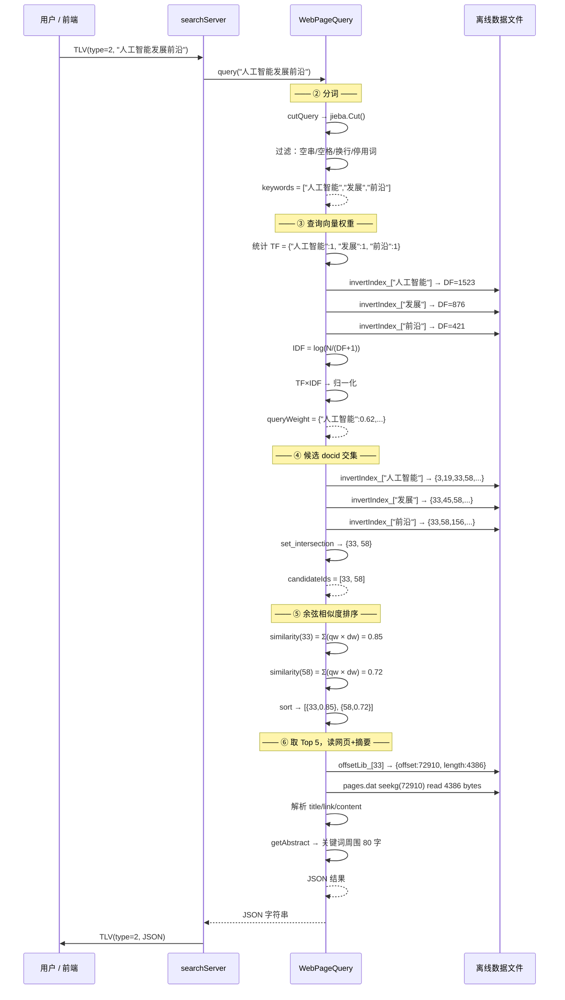

# 网页搜索模块（WebPageQuery）流程详解

## 目录

1. [模块概述](#1-模块概述)
2. [数据结构](#2-数据结构)
3. [启动加载：构造函数](#3-启动加载构造函数)
4. [查询入口：query()](#4-查询入口query)
5. [第一关：分词 —— cutQuery()](#5-第一关分词--cutquery)
6. [第二关：查询向量权重 —— calcQueryWeight()](#6-第二关查询向量权重--calcqueryweight)
7. [第三关：候选文档交集 —— getCandidateDocIds()](#7-第三关候选文档交集--getcandidatedocids)
8. [第四关：余弦相似度排序 —— rankPage()](#8-第四关余弦相似度排序--rankpage)
9. [第五关：随机读取网页 —— getDocById()](#9-第五关随机读取网页--getdocbyid)
10. [第六关：动态摘要 —— getAbstract()](#10-第六关动态摘要--getabstract)
11. [完整调用链路图](#11-完整调用链路图)
12. [与离线建库的对应关系](#12-与离线建库的对应关系)

---

## 1. 模块概述

`WebPageQuery` 是网页搜索引擎的**在线查询核心**。它接收用户输入的任意查询语句，通过 TF-IDF + 余弦相似度算法，从离线建好的倒排索引中找出最相关的网页，返回标题、链接、摘要和相关度分数。

**输入**：任意中文查询语句，如 `"人工智能发展前沿"`  
**输出**：JSON 格式的 Top 5 结果

```json
{
  "result": [
    {
      "rank": 1,
      "docid": 33,
      "score": 0.8521,
      "title": "人工智能技术综述",
      "link": "http://example.com/ai",
      "abstract": "...近年来人工智能在自然语言处理领域取得..."
    }
  ],
  "total": 127
}
```

**处理流程概览**：

```
查询语句 "人工智能发展前沿"
    │
    ├── ① 分词（jieba Mix 模式）
    │      ["人工智能", "发展", "前沿"]
    │      过滤停用词、空串、空格
    │
    ├── ② 计算查询向量权重（TF-IDF + 归一化）
    │      {"人工智能": 0.62, "发展": 0.45, "前沿": 0.64}
    │
    ├── ③ 求候选 docid 交集
    │      invertIndex_["人工智能"] ∩ invertIndex_["发展"] ∩ invertIndex_["前沿"]
    │      = {33, 78, 201, ...}
    │      找不到交集 → 返回错误
    │
    ├── ④ 余弦相似度排序
    │      对每个 docid，点积 = Σ(queryWeight[word] × docWeight[word][docid])
    │      按点积降序排列
    │
    └── ⑤ 取 Top 5，逐篇读网页 + 生成摘要 → JSON
```

---

## 2. 数据结构

### 2.1 类定义（`include/online/WebPageQuery.h`）

```cpp
#pragma once
#include <cppjieba/Jieba.hpp>
#include <string>
#include <unordered_map>
#include <unordered_set>
#include <utility>
#include <vector>

// --- 辅助结构体 ---

// 排序结果：一个 docid + 它的相关度分数
struct QueryResult
{
    int docid;        // 网页编号
    double score;     // 余弦相似度（0~1）
};

// 偏移信息：记录一篇文档在 pages.dat 中的位置
struct OffsetInfo
{
    long offset;      // 起始字节偏移
    long length;      // 占用字节数
};

// 网页内容：解析后的完整信息
struct WebPage
{
    int docid;
    std::string title;
    std::string link;
    std::string content;
};

// --- 主类 ---
class WebPageQuery
{
public:
    WebPageQuery();                                      // 构造函数，加载离线数据
    std::string query(const std::string& sentence);      // 主入口：查询并返回 JSON

private:
    void loadOffsetLib(const std::string& filename);     // 加载偏移库
    void loadInvertIndex(const std::string& filename);   // 加载倒排索引

    std::vector<std::string> cutQuery(const std::string& query);             // 分词
    std::unordered_map<std::string, double> calcQueryWeight(
        const std::vector<std::string>& words);                              // 查询向量权重
    std::vector<int> getCandidateDocIds(
        const std::vector<std::string>& words);                              // 候选 docid 交集
    std::vector<QueryResult> rankPage(
        const std::vector<int>& docids,
        const std::unordered_map<std::string, double>& queryWeight);        // 余弦排序
    WebPage getDocById(int docid);                                           // 随机读网页
    std::string getAbstract(
        const std::string& content,
        const std::vector<std::string>& words);                              // 动态摘要

private:
    cppjieba::Jieba tokenizer_;                                              // jieba 分词器
    std::unordered_set<std::string> stopWords_;                             // 停用词表
    std::string pageLibPath_;                                                // 网页库路径
    std::unordered_map<int, OffsetInfo> offsetLib_;                         // docid → 偏移
    std::unordered_map<std::string,                          // 关键词
        std::vector<std::pair<int, double>>> invertIndex_;  // → (docid, TF-IDF权重) 列表
};
```

### 2.2 核心容器示意

```
offsetLib_:
  ┌───────┬──────────────────────┐
  │ docid │ offset      length   │
  ├───────┼──────────────────────┤
  │   1   │ 0           6580     │
  │   2   │ 6580        8158     │
  │   3   │ 14738       3654     │
  │  ...  │ ...          ...     │
  └───────┴──────────────────────┘
  共 3788 条记录（= 去重后的文档总数）


invertIndex_:
  ┌──────────┬─────────────────────────────────────────┐
  │ keyword  │ [(docid, weight), (docid, weight), ...] │
  ├──────────┼─────────────────────────────────────────┤
  │ "人工智能"│ [(3,0.183), (19,0.092), (58,0.212), ...]│
  │ "机器学习"│ [(3,0.245), (41,0.113), ...]            │
  │  ...     │ ...                                     │
  └──────────┴─────────────────────────────────────────┘
  共 92769 个关键词
```

---

## 3. 启动加载：构造函数

服务器启动时，`searchServer` 创建 `WebPageQuery` 对象，构造函数一次性加载 3 个离线数据到内存。

```cpp
WebPageQuery::WebPageQuery()
    : pageLibPath_("data/pages.dat")           // 网页库路径（不加载内容，仅记录）
      ,tokenizer_()                             // jieba 分词器初始化
{
    // (1) 加载停用词表（英文停用词，过滤查询和分词结果中的无意义词）
    //     "the", "is", "a", "of", ... 等 800+ 词 → unordered_set，O(1) 查找
    stopWords_ = loadStopWords("data/stopwords/en_stopwords.txt");

    // (2) 加载偏移库
    //     data/offsets.dat → offsetLib_
    //     格式：docid offset length
    //     用途：后续 getDocById 时按 docid 查 offset 和 length
    loadOffsetLib("data/offsets.dat");

    // (3) 加载倒排索引
    //     data/index.dat → invertIndex_
    //     格式：keyword docid weight docid weight ...
    //     用途：查询时按关键词查包含它的所有 docid 及权重
    loadInvertIndex("data/index.dat");
}
```

**启动日志**：
```
offset size = 3788
invert Index size = 92769
```

---

## 4. 查询入口：query()

这是**对外的唯一入口函数**，把 6 个子步骤串联起来，最终返回 JSON。

```cpp
string WebPageQuery::query(const string& sentence)
{
    LOG_INFO << "Query :" << sentence;

    // =====================================================
    // 步骤 1：分词
    // =====================================================
    vector<string> keywords = cutQuery(sentence);
    if (keywords.empty())
    {
        // jieba 分词后全部被过滤（全是停用词/空格/标点）
        return R"({"error":"未识别到有效关键词"})";
    }

    // =====================================================
    // 步骤 2：计算查询向量中每个词的 TF-IDF 权重
    // =====================================================
    unordered_map<string, double> queryWeight = calcQueryWeight(keywords);
    if (queryWeight.empty())
    {
        // 所有关键词在倒排索引中都不存在
        return R"({"error":"关键词在索引库中未找到匹配"})";
    }

    // =====================================================
    // 步骤 3：在倒排索引中求所有关键词的 docid 交集
    //         必须同时包含全部关键词的文档才能入选
    // =====================================================
    vector<int> candidateIds = getCandidateDocIds(keywords);
    if (candidateIds.empty())
    {
        return R"({"error":"没有同时包含所有关键词的文档"})";
    }

    // =====================================================
    // 步骤 4：余弦相似度排序
    // =====================================================
    vector<QueryResult> ranked = rankPage(candidateIds, queryWeight);

    // =====================================================
    // 步骤 5：取 Top 5，逐篇读取网页 + 生成摘要 → JSON
    // =====================================================
    json response;
    response["total"] = ranked.size();

    json results = json::array();
    int topN = min(5, (int)ranked.size());
    for (int i = 0; i < topN; ++i)
    {
        int docid    = ranked[i].docid;
        double score = ranked[i].score;

        // 5a：通过偏移库随机访问网页库，读出一篇完整文档
        WebPage page = getDocById(docid);

        // 5b：生成动态摘要（找到关键词在正文中的位置，取前后 40 个字）
        string abstract = getAbstract(page.content, keywords);

        json item;
        item["rank"]     = i + 1;
        item["docid"]    = docid;
        item["score"]    = score;
        item["title"]    = page.title;
        item["link"]     = page.link;
        item["abstract"] = abstract;
        results.push_back(item);
    }

    response["result"] = results;
    LOG_INFO << "Found " << ranked.size() << " results, return top :" << topN;

    return response.dump(2);     // dump(2) = 带缩进、可读的格式化 JSON
}
```

---

## 5. 第一关：分词 —— cutQuery()

### 5.1 功能

把用户输入的任意字符串（如 `"人工智能 发展前沿！"`）处理成可用于搜索的**关键词列表**。

### 5.2 处理流水线

```
输入："人工智能 发展前沿！"
  │
  ├── jieba.Cut(sentence, words)        // Mix 模式分词
  │     words = ["人工智能", " ", "发展", "前沿", "！"]
  │
  ├── 过滤 1：跳过空字符串  ""
  ├── 过滤 2：跳过纯空格    " "
  ├── 过滤 3：跳过换行符    "\n"
  ├── 过滤 4：跳过停用词    查 stopWords_
  │
  └── 输出：["人工智能", "发展", "前沿"]
```

### 5.3 代码

```cpp
vector<string> WebPageQuery::cutQuery(const string& query)
{
    // (1) 用 jieba Mix 模式分词
    //     Mix = MP 精确模式 + HMM 新词识别，综合效果最好
    vector<string> words;
    tokenizer_.Cut(query, words);

    // (2) 逐词过滤
    vector<string> result;
    for (const auto& word : words)
    {
        if (word.empty())        continue;   // 空字符串
        if (word == " ")         continue;   // 纯空格（jieba 可能产生）
        if (word == "\n")        continue;   // 换行符
        if (stopWords_.count(word)) continue; // 停用词（"的"、"了"、"是" 等）
        result.push_back(word);
    }

    // 调试打印
    cout << "Cut Result : ";
    for (const auto& word : result)
        cout << "[" << word << "] ";
    cout << endl;

    return result;
}
```

---

## 6. 第二关：查询向量权重 —— calcQueryWeight()

### 6.1 功能

将分词后的关键词列表转为一个**查询向量**（vector）。每个维度是一个词的 TF-IDF 权重，所有维度的平方和为 1（归一化）。

### 6.2 算法步骤

```
输入：["人工智能", "发展", "人工智能"]   // "人工智能"出现 2 次
  │
  ├── Step 1: 统计每个词的频次
  │     tf = {"人工智能": 2, "发展": 1}
  │
  ├── Step 2: 查询倒排索引，获取每个词的 DF
  │     invertIndex_["人工智能"] → vector 长度 = 1523 → DF = 1523
  │     invertIndex_["发展"]     → vector 长度 = 876  → DF = 876
  │
  ├── Step 3: 计算 TF-IDF
  │     TF("人工智能") = 2 / 3 = 0.667     （出现次数/查询总词数）
  │     IDF("人工智能") = log(3788 / (1523 + 1)) = log(2.486) = 0.911
  │     weight("人工智能") = 0.667 × 0.911 = 0.607
  │
  │     TF("发展") = 1 / 3 = 0.333
  │     IDF("发展") = log(3788 / (876 + 1)) = log(4.318) = 1.462
  │     weight("发展") = 0.333 × 1.462 = 0.487
  │
  └── Step 4: 归一化
        模长 = sqrt(0.607² + 0.487²) = 0.778
        weight("人工智能") = 0.607 / 0.778 = 0.780
        weight("发展")     = 0.487 / 0.778 = 0.626
        向量模长 = sqrt(0.780² + 0.626²) = 1.0  ✓
```

### 6.3 关键设计细节

| 细节 | 说明 |
|------|------|
| TF 的分子 | 是该词在**查询语句**中出现的次数，不是文档中出现次数 |
| DF 的来源 | 从倒排索引的 list 长度获取（`it->second.size()`） |
| IDF 分母 `+1` | 平滑项，防止 `DF=0` 时除零（理论上不会发生，但防御性编程） |
| 归一化的目的 | 消除查询长短对权重绝对值的影响。短查询"足球"和长查询"足球比赛2024年世界杯"中的"足球"权重可比 |
| 文档总数 N | `offsetLib_.size()` — 偏移库每条记录对应一篇文档 |

### 6.4 代码

```cpp
unordered_map<string, double> WebPageQuery::calcQueryWeight(const vector<string>& words)
{
    // (1) 统计每个查询词的词频
    unordered_map<string, int> tf;
    for (const auto& word : words)
        ++tf[word];

    // (2) 文档总数 N = 偏移库大小
    size_t totalDocs = offsetLib_.size();   // 例如 3788

    unordered_map<string, double> weights;

    for (const auto& item : tf)
    {
        const string& word = item.first;

        // 只处理在倒排索引中存在的词（如果语料中没有这个词，跳过）
        auto it = invertIndex_.find(word);
        if (it == invertIndex_.end())
            continue;

        // (3) TF = 词在查询中出现次数 / 查询总词数
        double tfValue = static_cast<double>(item.second) / words.size();

        // (4) DF = 包含该词的文档数（倒排列表长度）
        size_t df = it->second.size();

        // (5) IDF = log(N / (DF + 1))
        double idfValue = log(static_cast<double>(totalDocs) / (df + 1));

        // (6) weight = TF × IDF
        weights[word] = tfValue * idfValue;
    }

    // (7) 归一化：每个权重除以向量模长
    double norm = 0.0;
    for (const auto& [word, weight] : weights)
        norm += weight * weight;
    norm = sqrt(norm);

    if (norm != 0.0)
    {
        for (auto& [word, weight] : weights)
            weight /= norm;           // 归一化后的权重
    }

    return weights;
}
```

---

## 7. 第三关：候选文档交集 —— getCandidateDocIds()

### 7.1 功能

从倒排索引中找到**同时包含所有关键词**的文档 id 集合。

### 7.2 为什么取交集而非并集

- **并集**：只要包含任意一个关键词就候选 → 结果很多但不相关
- **交集**：必须同时包含所有关键词 → 精确匹配，结果少但精准

本搜索引擎采用 AND 语义（交集），符合 PDF 规范。

### 7.3 算法演示

```
invertIndex_["人工智能"] → {3, 19, 33, 58, 78, 201, ...}
invertIndex_["发展"]     → {33, 45, 78, 89, 201, ...}
invertIndex_["前沿"]     → {33, 78, 156, 201, ...}

过程：
  step 0: result = {3, 19, 33, 58, 78, 201, ...}      ← 第一个词
  step 1: current = {33, 45, 78, 89, 201, ...}
          result = result ∩ current = {33, 78, 201, ...}
  step 2: current = {33, 78, 156, 201, ...}
          result = result ∩ current = {33, 78, 201}

最终候选：{33, 78, 201}
```

### 7.4 代码

```cpp
vector<int> WebPageQuery::getCandidateDocIds(const vector<string>& words)
{
    if (words.empty())
        return {};

    // ====================================================
    // 处理第一个词：把所有包含该词的 docid 作为初始集合
    // ====================================================
    auto it = invertIndex_.find(words[0]);
    if (it == invertIndex_.end())
        return {};

    set<int> result;
    for (const auto& e : it->second)       // it->second = vector<pair<int,double>>
        result.insert(e.first);             // 只取 docid，权重暂时不用

    // ====================================================
    // 逐个与后续词求交集
    // ====================================================
    for (size_t i = 1; i < words.size(); ++i)
    {
        auto iter = invertIndex_.find(words[i]);
        if (iter == invertIndex_.end())
            return {};                     // 有一个词不在索引中，直接返回空

        // 把当前词的 docid 集合放入 set（set 有序，交集算法要求有序）
        set<int> current;
        for (const auto& e : iter->second)
            current.insert(e.first);

        // std::set_intersection：标准库交集算法，O(m+n)
        set<int> temp;
        set_intersection(
            result.begin(), result.end(),
            current.begin(), current.end(),
            inserter(temp, temp.begin()));  // inserter = 输出迭代器，插入到 temp

        result = move(temp);               // 移动语义，避免拷贝

        if (result.empty())                // 中间某步交集为空，提前退出
            return {};
    }

    // set → vector
    return vector<int>(result.begin(), result.end());
}
```

> **为什么用 set 而不是继续 vector？**  
> `set_intersection` 要求两个输入序列**有序**。set 自动保持有序，且插入时自动去重（虽然倒排列表本身不会重复，但防御性更好）。

---

## 8. 第四关：余弦相似度排序 —— rankPage()

### 8.1 功能

对候选文档按与查询向量的余弦相似度降序排列。

### 8.2 余弦相似度公式

```
             A · B            Σ(Ai × Bi)
cos(θ) = ───────────── = ──────────────────────
          |A| × |B|      sqrt(ΣAi²) × sqrt(ΣBi²)
```

**关键简化**：由于查询向量（A）和文档向量（B）都已经在一期离线建库时归一化（模长 = 1），分母 = 1 × 1 = 1。所以余弦相似度简化成了**点积**：

```
similarity = Σ (queryWeight[word] × docWeight[word][docid])
```

> `docWeight[word][docid]` 是从离线倒排索引 `invertIndex_` 中取出的该词在该文档的归一化 TF-IDF 权重。

### 8.3 代码

```cpp
vector<QueryResult> WebPageQuery::rankPage(
    const vector<int>& docids,
    const unordered_map<string, double>& queryWeight)
{
    vector<QueryResult> results;

    // 遍历每个候选文档
    for (int docid : docids)
    {
        double similarity = 0.0;

        // 遍历查询中的每个关键词
        for (const auto& [word, qweight] : queryWeight)
        {
            // 从倒排索引中找这个词的 (docid, weight) 列表
            auto it = invertIndex_.find(word);
            if (it == invertIndex_.end())
                continue;

            // 在该词的倒排列表中，找到当前 docid 对应的权重
            for (const auto& [id, docWeight] : it->second)
            {
                if (id == docid)
                {
                    // 点积累加：qweight × docWeight
                    similarity += qweight * docWeight;
                    break;   // 找到就退出，一个词在一个文档中只有一个权重
                }
            }
        }

        results.push_back({docid, similarity});
    }

    // 按相似度降序排列（大的在前）
    sort(results.begin(), results.end(),
         [](const QueryResult& a, const QueryResult& b) {
             return a.score > b.score;
         });

    return results;
}
```

### 8.4 计算示例

```
查询向量：
  queryWeight = {"人工智能": 0.780, "发展": 0.626}

文档 33：
  invertIndex_["人工智能"] 中有 (33, 0.350)   // 文档 33 中"人工智能"的归一化权重
  invertIndex_["发展"]     中有 (33, 0.420)
  similarity(33) = 0.780 × 0.350 + 0.626 × 0.420
                 = 0.273 + 0.263
                 = 0.536

文档 78：
  invertIndex_["人工智能"] 中有 (78, 0.280)
  invertIndex_["发展"]     中有 (78, 0.510)
  similarity(78) = 0.780 × 0.280 + 0.626 × 0.510
                 = 0.218 + 0.319
                 = 0.537

文档 78 得分最高，排第一！
```

---

## 9. 第五关：随机读取网页 —— getDocById()

### 9.1 功能

给定一个 docid，从网页库 `pages.dat` 中读取该文档的完整内容。

### 9.2 为什么要偏移库

网页库 `pages.dat` 是**串联文件**——所有文档的 XML 块顺序拼在一起：

```
┌──────────────┬──────────────┬──────────────┬─────┐
│ <doc>        │ <doc>        │ <doc>        │ ... │
│   <id>1</id> │   <id>2</id> │   <id>3</id> │     │
│   ...        │   ...        │   ...        │     │
│ </doc>       │ </doc>       │ </doc>       │     │
│ 6580 bytes   │ 8158 bytes   │ 3654 bytes   │     │
└──────────────┴──────────────┴──────────────┴─────┘
 offset=0      offset=6580   offset=14738
```

没有偏移库的话，要找 docid=3 就必须从文件头开始逐篇解析，O(n) 时间。  
有了偏移库，直接 `seekg(14738)` 然后读 `3654` 字节，O(1) 时间。

### 9.3 代码

```cpp
WebPage WebPageQuery::getDocById(int docid)
{
    WebPage page;
    page.docid = docid;

    // (1) 从偏移库查找该 docid 的位置信息
    auto it = offsetLib_.find(docid);
    if (it == offsetLib_.end())
    {
        cerr << " docid not found in offset : " << docid << endl;
        return page;    // 返回空 page
    }

    long offset = it->second.offset;   // 起始字节位置
    long length = it->second.length;   // 文档占用字节数

    // (2) 打开网页库文件（每次打开和关闭，保证偏移量独立）
    ifstream ifs(pageLibPath_);
    if (!ifs)
    {
        cerr << " cannot open page lib : " << pageLibPath_ << endl;
        return page;
    }

    // (3) 定位到指定偏移量，读取 length 字节
    ifs.seekg(offset, ios::beg);          // 从文件头开始，移动 offset 字节
    string xmlBlock(length, '\0');         // 分配 length 字节缓冲区
    ifs.read(&xmlBlock[0], length);        // 读取 length 字节

    // (4) 从 XML 块中提取各字段（用 string::find 简单解析，无需 tinyxml2）
    auto titleStart = xmlBlock.find("<title>");
    auto titleEnd   = xmlBlock.find("</title>");
    if (titleStart != string::npos && titleEnd != string::npos)
    {
        titleStart += 7;   // 跳过 "<title>" 这 7 个字符
        page.title = xmlBlock.substr(titleStart, titleEnd - titleStart);
    }

    auto linkStart  = xmlBlock.find("<link>");
    auto linkEnd    = xmlBlock.find("</link>");
    if (linkStart != string::npos && linkEnd != string::npos)
    {
        linkStart += 6;   // 跳过 "<link>" 这 6 个字符
        page.link = xmlBlock.substr(linkStart, linkEnd - linkStart);
    }

    auto contentStart = xmlBlock.find("<content>");
    auto contentEnd   = xmlBlock.find("</content>");
    if (contentStart != string::npos && contentEnd != string::npos)
    {
        contentStart += 9;   // 跳过 "<content>" 这 9 个字符
        page.content = xmlBlock.substr(contentStart, contentEnd - contentStart);
    }

    return page;
}
```

> **为什么只用 `string::find` 而不引入 tinyxml2？**  
> 这块 XML 是第一期 `PageProcessor` 生成的，格式是固定的：`<doc><id/><title/><link/><content/></doc>`，不会有嵌套或属性。用 `find` 比 tinyxml2 更轻量，而且不用重新解析整个 XML 树。

---

## 10. 第六关：动态摘要 —— getAbstract()

### 10.1 功能

从一篇可能很长的正文中，找出**第一个关键词出现的位置**，截取前后各 40 个**字符**（不是字节），生成 80 字左右的摘要。

### 10.2 处理流程

```
正文（2000+ 字）
  │
  ├── 1. 按 UTF-8 字符拆分 → chars[]（每个元素一个汉字）
  │
  ├── 2. 正文 ≤ 80 字 → 返回全文
  │
  ├── 3. 逐关键词查找在正文中的位置
  │     找到字节位置 → 转换为字符位置
  │     取最早出现的字符位置
  │
  ├── 4. 没找到任何关键词 → 取正文前 80 字 + "..."
  │
  └── 5. 以关键词位置为中心，取前 40 + 后 40 字
        if 前面被截断 → 前缀加 "..."
        if 后面被截断 → 后缀加 "..."
```

### 10.3 字节位置 → 字符位置转换

UTF-8 是变长编码，一个汉字 3 字节，一个英文 1 字节。`string::find` 返回的是**字节位置**，但摘要要以**字符**为单位截取。

```cpp
// content = "ABC人工智能XYZ"
// 字节位置：A=0 B=1 C=2 人=3 工=6 智=9 能=12 X=15 Y=16 Z=17
// 字符位置：A=0 B=1 C=2 人=3 工=4 智=5 能=6 X=7  Y=8  Z=9

size_t charPos = 0;
const char* p = content.c_str();
const char* end = p + bytePos;
while (p < end)
{
    utf8::next(p, end);   // 前进一个 UTF-8 字符，无论它占几字节
    ++charPos;
}
// bytePos=12 → charPos=6
```

### 10.4 完整代码

```cpp
string WebPageQuery::getAbstract(const string& content,
                                  const vector<string>& words)
{
    // (1) 将正文按 UTF-8 字符拆成单个字符的数组
    auto chars = splitChinese(content);

    // (2) 正文很短（≤ 80 字）→ 直接返回全文
    if (chars.size() <= 80)
        return content;

    // (3) 找到第一个在正文中出现的关键词的字符位置
    size_t foundPos = string::npos;
    for (const auto& word : words)
    {
        // 找关键词在正文中的字节位置
        size_t bytePos = content.find(word);
        if (bytePos == string::npos)
            continue;    // 该关键词不在正文中，试下一个

        // 字节位置 → 字符位置
        size_t charPos = 0;
        const char* p   = content.c_str();
        const char* end = p + bytePos;
        while (p < end)
        {
            utf8::next(p, end);
            ++charPos;
        }

        // 保留最早出现的关键词位置
        if (foundPos == string::npos || charPos < foundPos)
            foundPos = charPos;
    }

    // (4) 没找到任何关键词 → 取正文前 80 字
    if (foundPos == string::npos)
    {
        string result;
        for (size_t i = 0; i < min((size_t)80, chars.size()); ++i)
            result += chars[i];
        return result + "...";
    }

    // (5) 以关键词为中心，取前后各 40 个字符
    size_t start = (foundPos >= 40) ? (foundPos - 40) : 0;
    size_t end   = min(foundPos + 40, chars.size());

    // 如果前面被截断 → 添加 "..."
    string prefix = (start > 0) ? "..." : "";
    // 如果后面被截断 → 添加 "..."
    string suffix = (end < content.size()) ? "..." : "";

    string result;
    for (size_t i = start; i < end; ++i)
        result += chars[i];

    return prefix + result + suffix;
}
```

---

## 11. 完整调用链路图



---

## 12. 与离线建库的对应关系

下表中，左列是第一期 `PageProcessor` 生成的文件和方法，右列是第二期 `WebPageQuery` 加载和使用它们的方式：

| 离线（第一期） | 在线（第二期） | 关键衔接 |
|---------------|---------------|----------|
| `build_pages_and_offsets` 生成 `pages.dat` + `offsets.dat` | `loadOffsetLib` 加载 `offsets.dat`，`getDocById` 读取 `pages.dat` | 偏移库 `{docid, offset, length}` 是随机访问的核心 |
| `build_inverted_index` 生成 `index.dat` | `loadInvertIndex` 加载 `index.dat` | 倒排索引中的 TF-IDF 权重是一期算好、二期直接用的 |
| 离线归一化权重 | `rankPage` 中的 `docWeight` | 离线归一化保证了二期余弦相似度 = 纯点积 |
| `deduplicate_documents` | 无（去重后的文档数决定 `totalDocs`） | N = `offsetLib_.size()` |
| XML `<doc>` 格式 | `getDocById` 的 `find` 解析 | 格式必须和一期输出一致：`<doc><id/><title/><link/><content/></doc>` |
